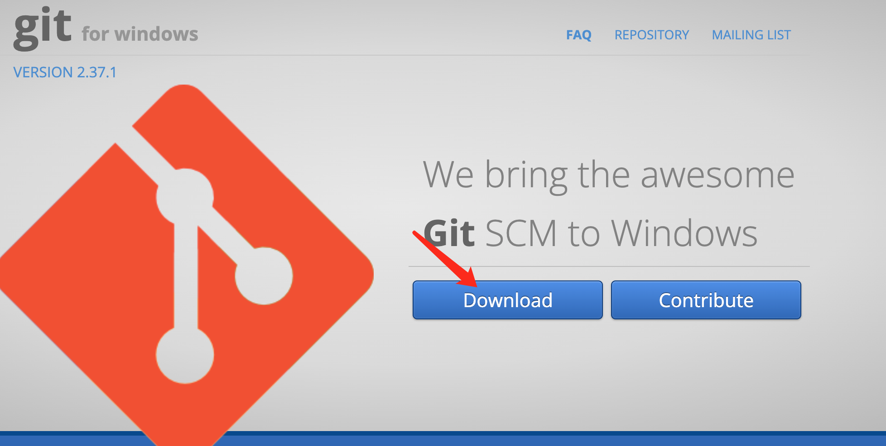
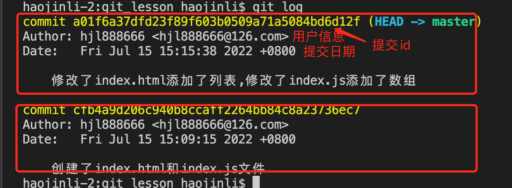
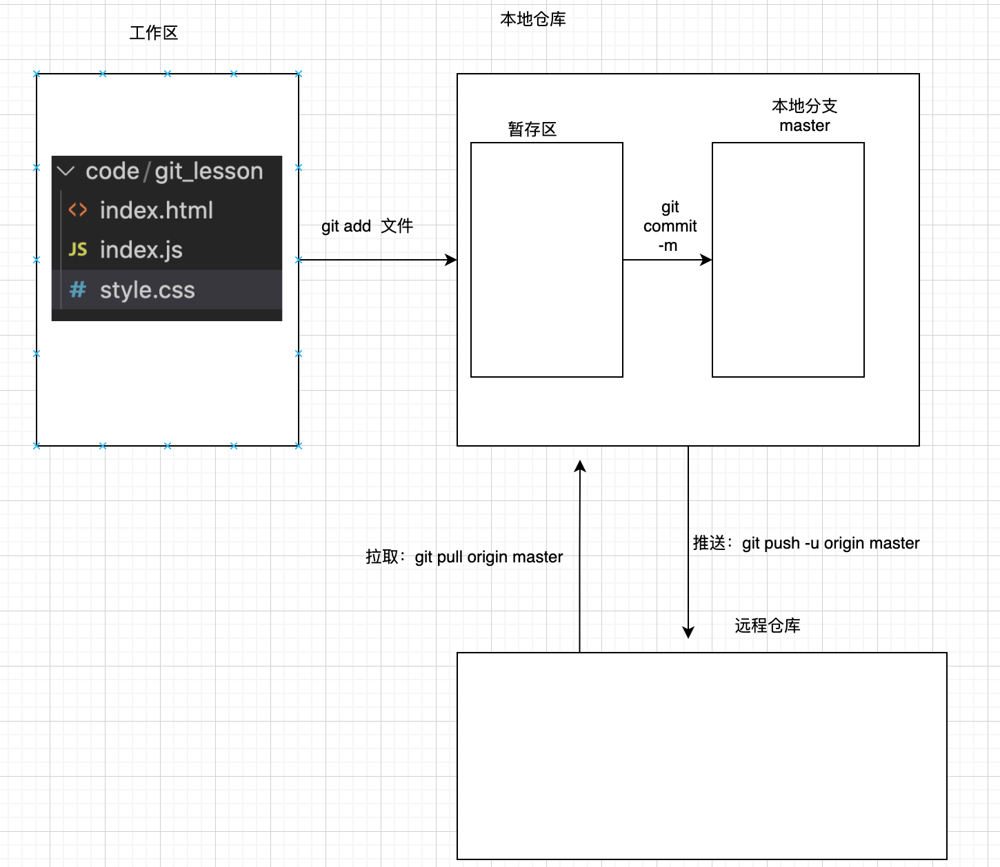
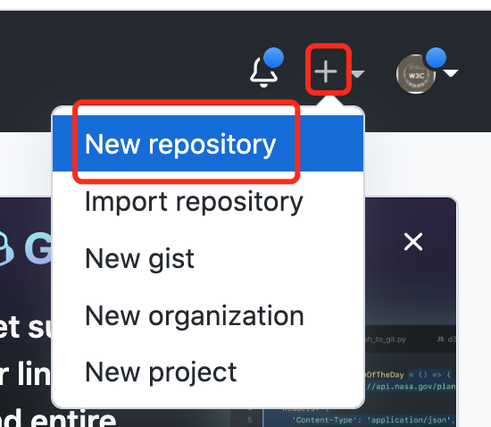
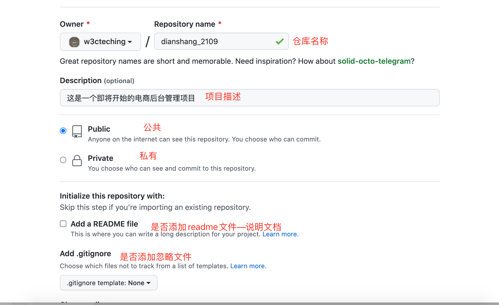

## 一、实训计划：

一、git

二、复习ES6

三、后台管理项目

四、大屏可视化（echarts和百度地图）

五、微信小程序项目

六、vue3项目

七、React

## 二、git 

### 2.1 git是什么

1. git是分布式版本控制工具，可以管理项目代码，团队协作开发

    > 注意：版本指的不是文件，指的是【修改】！！！！！

    分布式：不依赖于某个服务器，可以单独在某个电脑上操作

    集中式：所有电脑或终端都依赖于某个中心服务器，如果中心服务器宕机了，则整个网络瘫痪了

2. 工作方式：命令行和GUI图形界面方式【软件操作】

3. 版本控制工具：git和svn

      git:分布式  

     svn:集中式，软件：小乌龟图标

### 2.2 git环境

1. 官方下载地址：查看[这里](https://gitforwindows.org/)




2. 安装

3. 运行

    电脑空白处右键--选择git bash--打开命令行（就是一个黑窗口）

### 3.3 git常用命令

1. 查看电脑用户名和邮箱是否配置

```
 git config --list
```

2. 配置用户名

```bash
 git config --global user.name '用户名'
```

3. 配置邮箱：

```bash
git config --global user.email '2109A@126.com'
```

4. 初始化git

    ```
    git init
    ```

5. 查看git状态

    ```
    git status
    ```

6. 添加到暂存区

    ```
    git add 要添加的文件名
    ```

7. 提交到本地仓库分支

    ```bash
    git commit -m '要提交的说明'
    
    例如：git commit -m '创建了index.html和index.js文件'
    ```

8. 查看日志

    ```
    git log
    
    简洁写法：
    git log --pretty=oneline
    ```

    

9. xxxx

### 3.4 git推送远程

  将我的本地代码推送到远程仓库！！！！！！

#### 3.4.1 **远程仓库也称代码托管平台**

常用代码托管平台有：

- github
- 码云
- gitlab



#### 3.4.2 创建远程仓库

 注册一个gihub或码云帐号

登录

创建远程仓库






#### 3.4.3 创建和配置公钥和密钥

```
ssh-keygen -t rsa -b 4096 -C "邮箱名@126.com"  敲3回车


生成目录：c:/Users/你的用户名子/.ssh/id_rsa.pub 复制里面的全部内容到远程的https://github.com/settings/keys

id_rsa:密钥  留给自己
id_rsa.pub：公钥 放在远程仓库
```


#### 3.4.4   连接到远程

1. 测试是否能连接到远程

```
ssh -T git@github.com

返回结果：Hi w3cteching! You've successfully authenticated, 
```

2. 开始连接远程

    ```
    连接：
    
    git remote add origin git@github.com:w3cteching/dianshang_2109.git
    
    
    查看是否连接成功：
     git remote -v
    ```

#### 3.4.5 将代码推送到远程

```

```

> 如果git push推送失败，通常是远程仓库中有本地没有的文件代码，或远程仓库相同分支下的相同文件被你的队员改过，失败，
>
> 解决方案：先拉取，再推送
>
> 如果不出现问题
>
> ```
> 拉取：远程--本地
> git pull origin master --allow-unrelated-histories
> 
> 推送:本地--远程
>  git push -u origin master
> ```
>
> 

## 四、晚上任务：

1. 下晚自习睡觉前：说课--用微信语音在咱们群里说说今天讲的内容-完成的任务-遇到的问题--如何解决的
2. 完成课堂的任务
3. 完成JS原生小案例（一天至少4个）
4. 面试题一天至少背3道